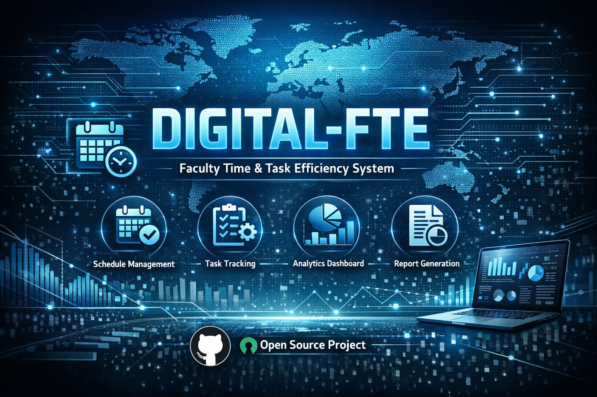

# 🤖 Digital-FTE — Abdullah Junior



> **"Tu vida y tu negocio en piloto automático. Un empleado de IA nativo de la nube, que se autoevoluciona y nunca duerme."**

[](https://github.com/AbdullahMalik17/Digital-FTE/actions/workflows/python-ci.yml)
[](https://github.com/AbdullahMalik17/Digital-FTE)
[](https://github.com/AbdullahMalik17/Digital-FTE)
[](https://opensource.org/licenses/MIT)
[](https://github.com/AbdullahMalik17/Digital-FTE/stargazers)
[](https://github.com/AbdullahMalik17/Digital-FTE/commits/main)
[](https://github.com/AbdullahMalik17/Digital-FTE)

- **Docs**: Ejecuta `npx mintlify dev docs` (consulta `docs/README.md`) y añade aquí la URL de tu documentación desplegada.

---

## 🎬 ¿Qué es esto?

**Digital-FTE** es un sistema de agentes de IA autónomo de código abierto que actúa como un Empleado Digital 24/7 para tu vida personal y negocio. Observa tu Gmail, WhatsApp y LinkedIn — redacta respuestas, crea facturas, publica en redes sociales y ejecuta tareas — todo con **aprobación humana** antes de que se tome cualquier acción.

Utiliza una **Arquitectura de Doble Agente** (Cloud Sentry + Local Executive) conectada por un **Obsidian Vault** como sistema nervioso central. El sistema también puede **depurar y evolucionarse a sí mismo**, lo que lo convierte en una de las primeras implementaciones de empleados de IA autoevolutivos en código abierto.

```
📬 Email Arrives → 🤖 Cloud Agent Drafts Reply → 📂 Saved to Vault
→ 📱 You Approve on Phone → ⚡ Local Agent Executes → ✅ Done
```

---

## ✨ Características principales

- **📧 Gmail Watcher** — Monitorea la bandeja de entrada, categoriza correos y redacta respuestas con contexto
- **🏢 Contabilidad con Odoo** — Crea facturas automáticamente y registra gastos desde recibos por correo
- **📱 Piloto automático en redes sociales** — Publica en Facebook, Instagram y Twitter/X con análisis de métricas
- **🧠 Orquestador inteligente** — Enruta las tareas al mejor modelo de IA (Claude 3.5, Gemini 1.5 Pro, etc.)
- **🔐 Humano en el bucle (Human-in-the-Loop)** — Nada se ejecuta sin tu aprobación. Nunca.
- **🔄 Motor de autoevolución** — Detecta sus propios errores y escribe sus propios parches
- **📂 Sincronización con Obsidian Vault** — Base de conocimientos sincronizada con Git como memoria del sistema
- **🐳 Listo para Docker** — Despliegue con un solo comando usando docker-compose
- **🧪 Suite completa de pruebas** — Incluye pruebas unitarias, de integración y E2E

---

## 🏗️ Arquitectura

El sistema ejecuta dos agentes en paralelo:

### ☁️ Agente en la Nube (El "Centinela")
- **Vive en:** Cualquier servidor en la nube o máquina con encendido permanente
- **Monitorea:** Gmail (IMAP), API de LinkedIn, WhatsApp Web
- **Realiza:** Lee los mensajes entrantes, redacta respuestas usando IA y escribe propuestas en el Vault
- **No puede:** Acceder a credenciales financieras o ejecutar nada — diseñado solo para lectura

### 💻 Agente Local (El "Ejecutivo")
- **Vive en:** Tu máquina personal
- **Sincroniza:** Hace git pull del Vault cada 60 segundos
- **Realiza:** Te notifica de tareas pendientes, espera tu aprobación y luego ejecuta a través de servidores MCP
- **Tiene acceso a:** Odoo, APIs de redes sociales, archivos locales y credenciales sensibles

### 🧠 El Orquestador
El cerebro que enruta cada tarea a la herramienta y modelo de IA correctos basándose en la complejidad y el costo.

```
┌─────────────────────────────────────────────────┐
│                  DIGITAL FTE LOOP               │
│                                                 │
│  📬 Input → ☁️ Cloud Agent → 📂 Vault (Git)     │
│                                  ↓              │
│            ✅ You Approve → 💻 Local Agent       │
│                                  ↓              │
│         ⚡ MCP Execution → 📁 Archive to Done   │
└─────────────────────────────────────────────────┘
```

---

## 🔌 Integraciones (vía servidores MCP)

| Servicio | Qué hace |
|---|---|
| **Gmail** | Lee, categoriza y redacta respuestas con contexto |
| **Odoo** | Crea facturas, registra facturas de proveedores y resúmenes financieros |
| **Facebook / Instagram** | Publica contenido y obtiene analíticas de interacción |
| **Twitter / X** | Publica tweets/hilos y monitorea menciones |
| **WhatsApp** | Lee mensajes y redacta respuestas |
| **Playwright** | Automatización del navegador para tareas web |

---

## 🚀 Inicio rápido

### Requisitos previos
- Python 3.10+
- Node.js 18+
- Docker (opcional pero recomendado)
- Un vault de Obsidian (para la sincronización del Vault)

### 1. Clona el repositorio
```bash
git clone https://github.com/AbdullahMalik17/Digital-FTE.git
cd Digital-FTE
```

### 2. Instala las dependencias
```bash
pip install -r requirements.txt
```

### 3. Configura el entorno
```bash
cp .env.example .env
# Completa tus claves API (consulta la sección de Configuración más abajo)
```

### 4. Inicia el sistema
```bash
# Inicia el agente local
python src/local_agent.py

# En una terminal separada, inicia los observadores (watchers)
python src/service_manager.py
```

### 5. (Opcional) Despliegue con Docker
```bash
docker-compose up --build
```

---

## ⚙️ Configuración

Edita tu archivo `.env` con lo siguiente:

```env
# Modelos de IA
OPENAI_API_KEY=your_key
ANTHROPIC_API_KEY=your_key
GOOGLE_API_KEY=your_key

# Gmail
GMAIL_CLIENT_ID=your_id
GMAIL_CLIENT_SECRET=your_secret

# Odoo (Contabilidad)
ODOO_URL=https://your-odoo-instance.com
ODOO_USERNAME=your_email
ODOO_PASSWORD=your_password

# Redes Sociales
META_ACCESS_TOKEN=your_token
FACEBOOK_PAGE_ID=your_page_id
INSTAGRAM_ACCOUNT_ID=your_account_id
TWITTER_API_KEY=your_key
TWITTER_API_SECRET=your_secret
TWITTER_BEARER_TOKEN=your_token
```

---

## 📂 Estructura del Vault

Tu Obsidian Vault está organizado por estado de las tareas:

| Carpeta | Propósito |
|---|---|
| `Needs_Action/` | Disparadores entrantes nuevos que esperan un borrador de la IA |
| `Pending_Approval/` | Tareas en borrador que esperan tu aprobación |
| `In_Progress/` | Tareas en ejecución activa |
| `Done/` | Archivo permanente de cada acción completada |
| `Logs/Audit/` | Registro de auditoría completo en JSONL de cada llamada a la IA |
| `Plans/` | Objetivos estratégicos a largo plazo y desgloses |

---

## 🧪 Pruebas

```bash
# Ejecuta la suite completa de pruebas
pytest tests/

# Módulos de pruebas individuales
pytest tests/test_odoo_integration.py      # Conexión con Odoo + facturas
pytest tests/test_social_media_apis.py    # Tokens de API de Meta + Twitter
pytest tests/e2e_gold_phase_test.py       # Flujo completo Gmail → Odoo → WhatsApp
```

---

## 🌱 Motor de Autoevolución

Una de las características más únicas de Digital-FTE es su **sistema Guardian**:

1. Si cualquier script falla, el traceback se captura automáticamente
2. Guardian envía el error + contexto a la IA
3. La IA escribe un parche y lo propone en el Vault
4. Tú apruebas → el parche se aplica automáticamente

Esto significa que el sistema se vuelve más inteligente y estable con el tiempo con una intervención manual mínima.

---

## 🗺️ Hoja de ruta

- [ ] WhatsApp Business API (reemplazando Web scraping)
- [ ] Integración de interfaz de voz
- [ ] Soporte multiusuario (equipo FTE)
- [ ] Panel de observabilidad de LangFuse
- [ ] Aplicación móvil para aprobaciones (React Native)
- [ ] Marketplace de plugins para conectores MCP personalizados

---

## 🤝 Contribuir

¡Las contribuciones son muy bienvenidas! Este es un proyecto de código abierto activamente mantenido.

1. Haz un fork del repositorio
2. Crea una rama de característica (`git checkout -b feature/amazing-feature`)
3. Realiza el commit de tus cambios (`git commit -m 'Add amazing feature'`)
4. Haz push y abre un Pull Request

Por favor, abre un issue primero para cambios importantes para que podamos discutir la dirección.

---

## 👨💻 Autor

**Muhammad Abdullah Athar** (AbdullahMalik17)  
Desarrollador de IA Agéntica | Ingeniero Full-Stack | Programa de IA Agéntica de Panaversity  
📍 Bahawalpur, Pakistan

- 🌐 [Portfolio](https://portfolio-ai-assistant-of-malik.vercel.app/)
- 💼 [LinkedIn](https://www.linkedin.com/in/muhammad-abdullah-athar)
- 📧 [muhammadabdullah51700@gmail.com](mailto:muhammadabdullah51700@gmail.com)

---

## 📄 Licencia

Este proyecto está licenciado bajo la Licencia MIT.

---

⭐ **Si este proyecto te inspira o te ahorra tiempo, por favor dale una estrella — ¡ayuda a que más desarrolladores lo descubran!**
